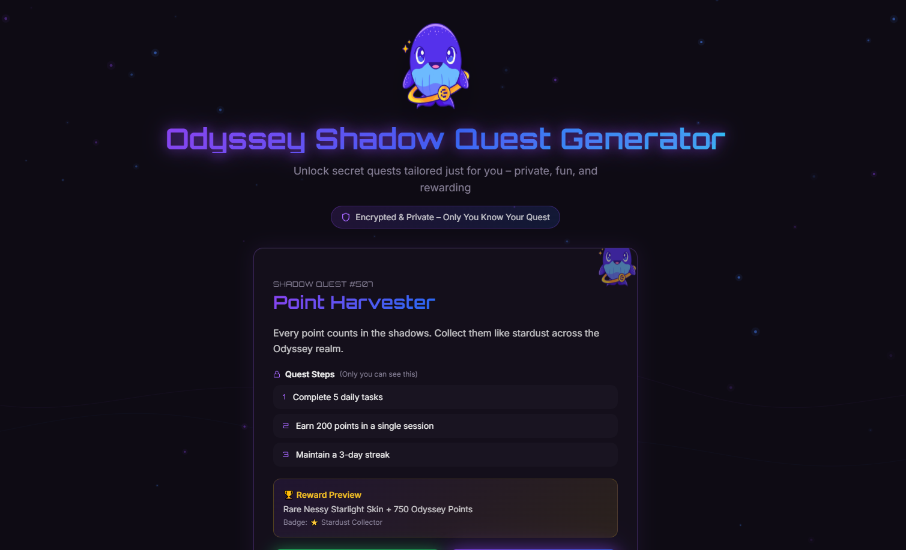

# Odyssey Shadow Quest Generator

An AI-powered web tool that creates personalized, private "Shadow Quests" for Odyssey users – secret tasks tailored to their level, interests, and goals to boost engagement, invites, and points in the Endless ecosystem.

**Live Demo:** https://odyssey-shadow-quest-generator.vercel.app/



## What It Does
This mini-app allows users to:
- Input current Odyssey level, interests (chips), and personal goal
- Generate a unique "Shadow Quest" (private, encrypted task – only user can see)
- Preview quest with dramatic reveal animation (Nessy peeks from shadows)
- "Accept" quest → success confetti + Nessy victory dance
- Share anonymized "Public Echo" version for X/Discord to inspire others

Quests encourage real actions (invite friends, earn points, explore Luffa) – all privacy-preserved with mock E2EE + DID.

## Why It Matters to the Endless Ecosystem
- **Personalized gamification**: Odyssey tasks are general – Shadow Quests make them feel unique & private.
- **Boosts viral growth**: Anonymized shares create FOMO & more invites without exposing personal data.
- **Increases retention**: Secret goals motivate users to return daily for progress & rewards.
- **Privacy-first innovation**: Mock E2EE ensures quests stay private – aligns with Endless core mission (DID + E2EE + relays).
- **Viral & community driver**: Encourages social learning (see others share echoes → imitate behavior).

## Features (MVP)
- Level slider + interest chips + goal textarea
- AI mock quest generation (random templates based on inputs)
- Dramatic quest reveal with shadow effects & Nessy cameo
- Accept quest → confetti + Nessy dance animation
- Share anonymized echo for social
- Responsive dark-mode UI (Endless aesthetic: purple-black-blue-white)
- Pure React + Tailwind CSS + Framer Motion – easy to extend

## How to Run / Test
1. Clone the repo:
   ```bash
   git clone https://github.com/duchth1993/odyssey-shadow-quest-generator.git
2. Install dependencies:
   ```bash
   npm install
3. Run locally:
   ```bash
   npm run dev
4. Or visit live demo: https://odyssey-shadow-quest-generator.vercel.app/

## Future Improvements
- Connect real Odyssey API for live level & interests
- Add E2EE encryption for quest data
- On-chain quest verification mock (testnet)
- Reward reveal animation with mock EDS/points
- Shareable quest echoes with privacy watermark

## Built for
Endless Monthly Contribution Program for Developers
Submission for: March 2026 cycle 
@EndlessProtocol @EndlessDevTeam #EndlessDev
Made with for gamified, private, & viral community growth
Repo: https://github.com/duchth1993/odyssey-shadow-quest-generator

